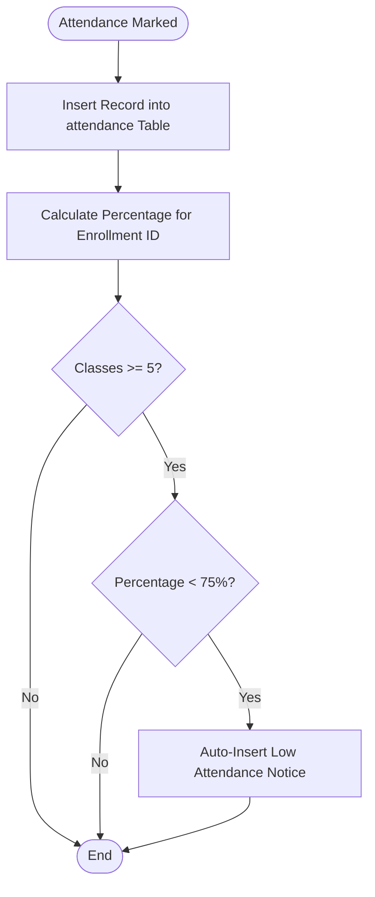
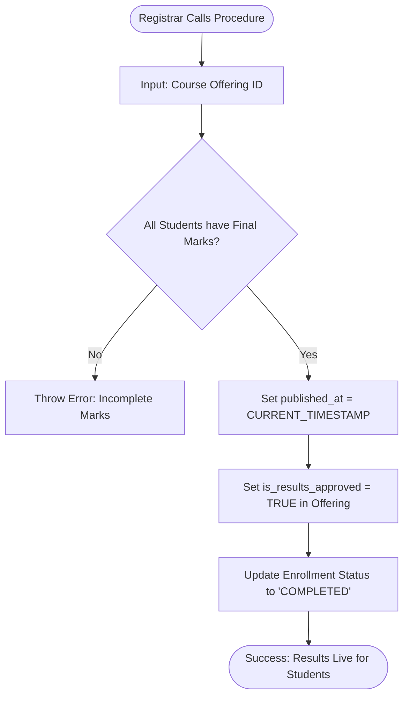
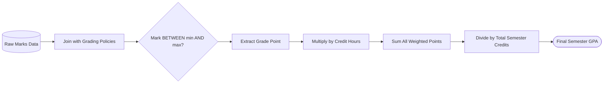
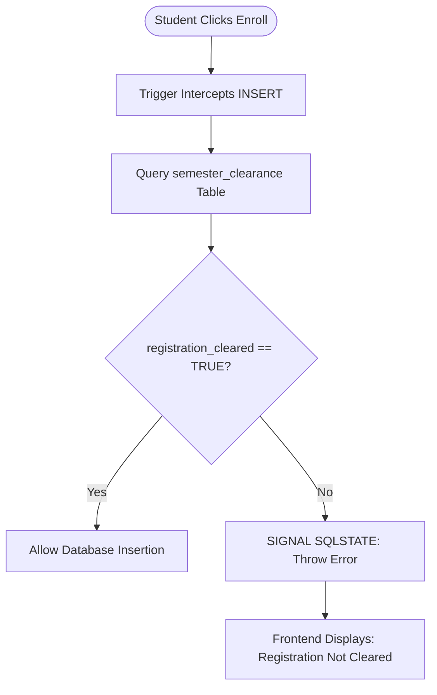

# UAMS: Database Logic Flowcharts

Use these Mermaid diagrams to visually explain your complex SQL logic during the presentation. These are perfect for Slide 14, 15, and 16.

---

## ⚡ 1. Trigger: Attendance Warning Flow
*Explaining `trg_attendance_low_warning`*

---

## ⚙️ 2. Procedure: Result Publishing Workflow
*Explaining `sp_publish_results`*

---

## 📊 3. View: Dynamic GPA Calculation
*Explaining `v_student_semester_summary`*

---

## 🛡 4. Trigger: Enrollment Clearance Check
*Explaining `trg_enrollment_requires_clearance`*

---

> [!TIP]
> **Slide Design Tip**: When putting these on a slide, keep the diagram on one side and the actual SQL code snippet on the other. This shows that you understand the "Logic" (Flowchart) and the "Syntax" (Code).
