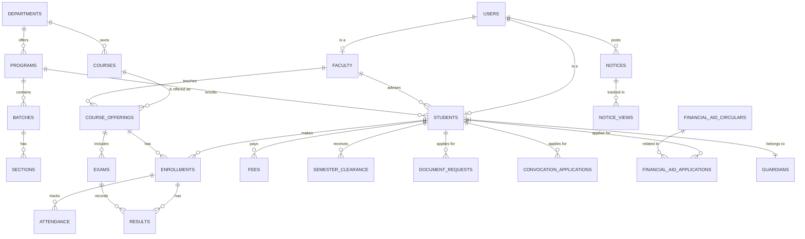

# UAMS: Entity-Relationship Diagram (ERD)

This document provides a technical Mermaid ER diagram and a summary of the 28 tables in the UAMS database.

## 1. Visual ER Diagram (Mermaid)

## 2. Table Groups

### Core Identity & Hierarchy
- `users`: Central authentication and profile data.
- `departments`: Academic units (e.g., CSE, EEE).
- `programs`: Degrees offered (e.g., BSc in CSE).
- `semesters`: Academic terms (e.g., Spring 2024).

### Academic Entities
- `students`: Detailed student records linked to users.
- `faculty`: Academic staff records linked to users.
- `courses`: The course catalog.
- `batches`: Student year/cohort groups.
- `sections`: Specific class divisions.

### Operations
- `course_offerings`: Courses assigned to faculty/batch in a semester.
- `enrollments`: Connection between students and course offerings.
- `attendance`: Daily presence tracking.
- `exams`: Assessment definitions (Mid, Final, Quiz).
- `results`: Marks obtained by students in exams.

### Financial & Admin
- `fees`: Tuition and registration fee records.
- `semester_clearance`: Multi-tier (Reg/Mid/Final) clearance status.
- `notices`: System-wide or role-targeted announcements.
- `document_requests`: Transcripts and certificates.
- `convocation_applications`: Graduation ceremony requests.
- `financial_aid_circulars` & `applications`: Scholarship management.

---

## 3. Existing ERD Files
You can also find professional diagrams already generated in your project folder:
- **Image**: [erd.png](file:///E:/Project/DBMS/uams/erd/erd.png)
- **PDF**: [erd.pdf](file:///E:/Project/DBMS/uams/erd/erd.pdf)
- **Vector**: [erd.svg](file:///E:/Project/DBMS/uams/erd/erd.svg)
- **MySQL Model**: [erd_model.mwb](file:///E:/Project/DBMS/uams/erd/erd_model.mwb)

> [!IMPORTANT]
> **Presentation Tip**: Use the **Mermaid diagram** above for your slides if you want a clean, stylized look. Use the **MySQL Workbench Model** if the teacher asks to see the technical physical schema.
