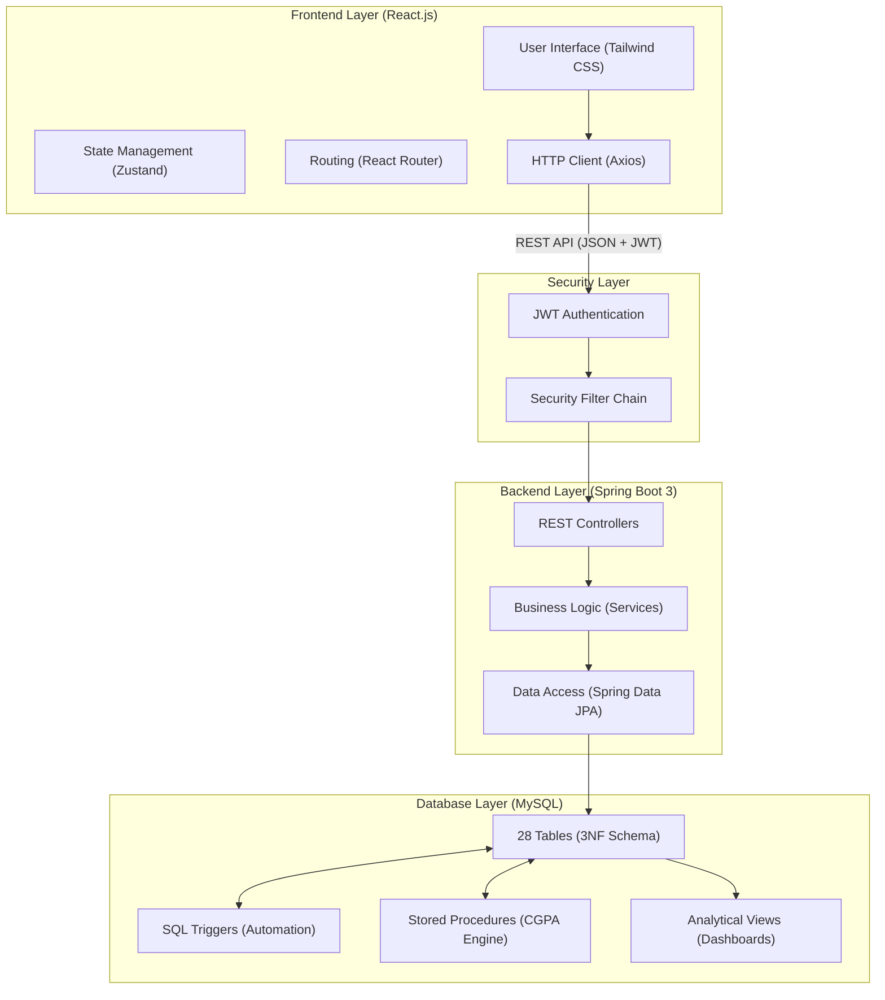

# UAMS System Architecture

This document describes the high-level architecture of the University Academic Management System (UAMS). This can be used as a primary source for Slide 4 and Slide 5 of your presentation.

## 1. High-Level Architecture Diagram

## 2. Component Breakdown

### A. Frontend Layer (The User Experience)
*   **React 18**: Uses functional components and hooks for a reactive UI.
*   **Vite**: The build tool ensuring fast HMR (Hot Module Replacement).
*   **Tailwind CSS**: Utility-first styling for a responsive and modern dashboard.
*   **Zustand**: Lightweight state management for handling user sessions and global UI states.
*   **Axios**: Manages asynchronous API calls to the backend.

### B. Security Layer (The Gatekeeper)
*   **JWT (JSON Web Tokens)**: Used for stateless authentication. Once a user logs in, the server issues a signed token.
*   **Spring Security**: Enforces role-based access control (RBAC). It ensures that a `STUDENT` cannot access `REGISTRAR` endpoints.
*   **Security Filter Chain**: Intercepts every request to validate the JWT in the header.

### C. Backend Layer (The Brain)
*   **Spring Boot 3**: The core framework for building the RESTful API.
*   **REST Controllers**: Define the API endpoints (e.g., `/api/auth/login`, `/api/students/me`).
*   **Service Layer**: Contains the complex business logic, such as calculating fees or processing result approvals.
*   **Spring Data JPA**: Simplifies data persistence using the Repository pattern, mapping Java objects to MySQL tables.

### D. Database Layer (The Foundation)
*   **MySQL (3NF)**: The relational database management system. The schema is optimized for consistency and performance.
*   **Business Logic in DB**:
    *   **Triggers**: Handle real-time constraints (e.g., preventing over-enrollment).
    *   **Stored Procedures**: Handle computationally expensive tasks (e.g., iterating through thousands of result records for CGPA).
    *   **Views**: Provide pre-computed data for the Admin/Faculty dashboards to reduce query latency.

---

## 3. Communication Flow (The Lifecycle of a Request)

1.  **Request**: User clicks "Enroll" on the React frontend.
2.  **API Call**: Axios sends a POST request to `/api/enrollments` with the JWT token in the `Authorization` header.
3.  **Authentication**: Spring Security validates the JWT.
4.  **Authorization**: The system checks if the user has the `STUDENT` role.
5.  **Service Logic**: The `EnrollmentService` prepares the data.
6.  **Database Trigger**: MySQL executes `trg_check_seat_limit`. If the seat limit is reached, it throws an error.
7.  **Response**: The backend catches any DB errors and sends a clean JSON error message back to the frontend.
8.  **UI Update**: The React UI shows a "Section Full" notification to the user.

> [!IMPORTANT]
> **Presentation Tip**: Use this diagram to explain how your project isn't just a simple website, but a multi-tiered enterprise application where data moves securely through multiple layers.
