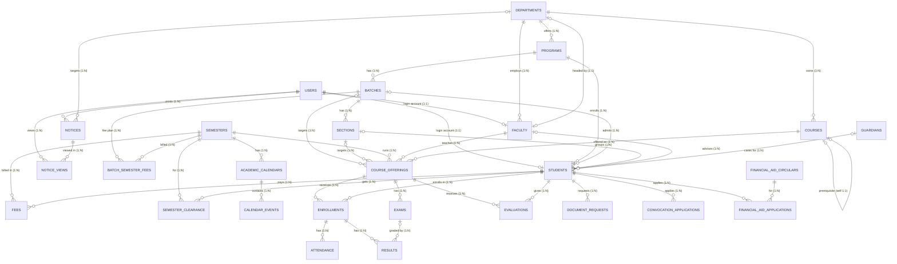

# Chapter 3: Database Design (ER Diagram & Schema)

> **University Academic Management System (UAMS)** — Royal Bengal University (RBU)
> DBMS Lab Mini Project Report — Chapter 3 (ready to paste into the report template)

**Chapter Outline:** This chapter presents the database design of UAMS. It begins with an overview of the design approach (Section 3.1), followed by the Entity–Relationship (ER) diagram with all entities, relationships, and cardinalities (Section 3.2). Section 3.3 maps the ER model to the relational schema (28 tables), Section 3.4 explains the normalization of the schema to Third Normal Form (3NF) with concrete examples, and Section 3.5 provides the data dictionary. Section 3.6 summarizes all integrity constraints (primary keys, foreign keys, unique keys, ENUM validations, and ON DELETE rules), and Section 3.7 states the outcome of the database design.

---

## 3.1 Overview

The database is the heart of UAMS. Every feature of the application — registration, enrollment, attendance, results, fees, clearance, notices — reads from and writes to this database. Therefore, the database was designed first, with the following principles:

- **Entity-first modeling:** All real-world objects (student, faculty, course, enrollment, fee, notice, …) are modeled as entities, and the relationships between them (enrolls in, teaches, pays, …) are modeled explicitly with cardinalities.
- **Normalization to 3NF:** The schema is decomposed so that no partial or transitive dependencies exist, eliminating redundancy and update anomalies.
- **Referential integrity:** Every relationship is enforced with a named foreign key constraint and an explicit `ON DELETE` behavior (`CASCADE`, `RESTRICT`, or `SET NULL`).
- **Data types and validation:** Primary keys are `CHAR(36)` (UUID), business codes are `UNIQUE`, and categorical attributes use `ENUM` to restrict values.
- **Dependency-ordered creation:** The schema file creates tables in dependency order (independent tables first, dependent tables later), and the one circular reference (`departments ↔ faculty`) is resolved with `ALTER TABLE` after both tables exist.

The final design contains **28 tables**, **43 foreign key constraints**, **22 unique keys**, and **15 ENUM-valued columns**, populated with realistic seed data (20+ records per table).

## 3.2 ER Diagram

### 3.2.1 Entities

The ER model contains 28 entity types, grouped into three categories:

| Category | Entities |
|---|---|
| **Master / Lookup** (reference data) | `departments`, `programs`, `batches`, `sections`, `semesters`, `guardians`, `grading_policies`, `financial_aid_circulars` |
| **Account / Catalog** | `users`, `faculty`, `students`, `courses`, `academic_calendars` |
| **Transaction** (day-to-day operations) | `course_offerings`, `enrollments`, `exams`, `results`, `attendance`, `fees`, `batch_semester_fees`, `semester_clearance`, `notices`, `notice_views`, `calendar_events`, `document_requests`, `convocation_applications`, `financial_aid_applications`, `evaluations` |

### 3.2.2 Relationships (with real-life relation names)

Each relationship in the ER diagram is identified by its **real-life relation name** (what it means in the university) and implemented in SQL by the corresponding **foreign key constraint**:

| ERD Relation Name (Real-life) | Constraint Name | Cardinality | From → To |
|---|---|---|---|
| Student **enrolls in** Program | `fk_student_program` | 1 : N | programs → students |
| Student **is advised by** Faculty | `fk_student_advisor` | 1 : N | faculty → students |
| Student **belongs to** Batch | `fk_student_batch` | 1 : N | batches → students |
| Student **belongs to** Section | `fk_student_section` | 1 : N | sections → students |
| Student **has** Guardian | `fk_student_guardian` | 1 : N | guardians → students |
| Faculty **uses** User account | `fk_faculty_user` | 1 : 1 | users → faculty |
| Faculty **works in** Department | `fk_faculty_department` | 1 : N | departments → faculty |
| Department **is headed by** Faculty | `fk_department_head` | 1 : 1 | faculty → departments |
| Course **belongs to** Department | `fk_course_department` | 1 : N | departments → courses |
| Course **requires** Course (prerequisite) | `fk_course_prerequisite` | 1 : 1 (self) | courses → courses |
| Course Offering **is offered for** Course | `fk_offering_course` | 1 : N | courses → course_offerings |
| Course Offering **runs in** Semester | `fk_offering_semester` | 1 : N | semesters → course_offerings |
| Course Offering **is taught by** Faculty | `fk_offering_faculty` | 1 : N | faculty → course_offerings |
| Student **enrolls in** Course Offering | `fk_enrollment_student`, `fk_enrollment_offering` | M : N | students ↔ course_offerings (via `enrollments`) |
| Enrollment **has** Attendance | `fk_attendance_enrollment` | 1 : N | enrollments → attendance |
| Course Offering **has** Exam | `fk_exam_offering` | 1 : N | course_offerings → exams |
| Enrollment **receives** Result | `fk_result_enrollment` | 1 : N | enrollments → results |
| Exam **is graded in** Result | `fk_result_exam` | 1 : N | exams → results |
| Student **pays** Fee | `fk_fee_student` | 1 : N | students → fees |
| Fee **belongs to** Semester | `fk_fee_semester` | 1 : N | semesters → fees |
| Batch **has** Semester Fee Plan | `fk_bsfee_batch`, `fk_bsfee_semester` | M : N | batches ↔ semesters (via `batch_semester_fees`) |
| User **posts** Notice | `fk_notice_user` | 1 : N | users → notices |
| Notice **targets** Department | `fk_notice_department` | 1 : N | departments → notices |
| User **views** Notice | `fk_view_notice`, `fk_view_user` | M : N | users ↔ notices (via `notice_views`) |
| Student **gets** Clearance | `fk_clearance_student`, `fk_clearance_semester` | M : N | students ↔ semesters (via `semester_clearance`) |
| Student **gives** Evaluation | `fk_evaluation_student`, `fk_evaluation_offering` | M : N | students ↔ course_offerings (via `evaluations`) |
| Student **requests** Document | `fk_doc_request_student` | 1 : N | students → document_requests |
| Student **applies for** Convocation | `fk_convocation_student` | 1 : N | students → convocation_applications |
| Student **applies for** Financial Aid | `fk_fa_app_student`, `fk_fa_app_circular` | M : N | students ↔ financial_aid_circulars (via `financial_aid_applications`) |
| Semester **has** Academic Calendar | `fk_calendar_semester` | 1 : 1 | semesters → academic_calendars |
| Calendar **contains** Events | `fk_event_calendar` | 1 : N | academic_calendars → calendar_events |

> **নোট (Relation Name vs Constraint Name):** ER diagram-এ relation গুলো উপরের real-life নামে লেখা হয় (যেমন "Student enrolls in Course Offering")। SQL-এ সেই relation-কে implement করে constraint (যেমন `fk_enrollment_student`)। Report-এ দুটোই দেখানো ভালো — ERD-তে real-life নাম, schema-তে constraint নাম।

### 3.2.3 Figure 3.1 — ER Diagram

**Figure 3.1** shows the core ER diagram (18 core entities; the complete 28-entity diagram is available in the Appendix and as `mermaid/er_diagram.mmd`):

> **Figure 3.1: UAMS Core ER Diagram** — *(insert `er_diagram_core.png` here)*
>
> 

The full ER diagram (`mermaid/er_diagram.mmd`) contains all 28 entities and 43 relationships, including the many-to-many relationships resolved through the junction tables `enrollments`, `notice_views`, `batch_semester_fees`, `semester_clearance`, `evaluations`, and `financial_aid_applications`, and the self-referencing relationship on `courses` (prerequisite).

## 3.3 Relational Schema (ER → Table Mapping)

The ER model is mapped to a relational schema using the standard mapping rules: each entity becomes a table, each 1:N relationship adds a foreign key column to the "N" side, each M:N relationship becomes a junction table with a composite of the two foreign keys, and each 1:1 relationship places the foreign key on either side (with a UNIQUE constraint).

### 3.3.1 Table Inventory (28 Tables)

| # | Table | Type | Primary Key | Main Foreign Keys |
|---|---|---|---|---|
| 1 | `users` | Master | `id` | — |
| 2 | `departments` | Master | `id` | `head_faculty_id` → faculty |
| 3 | `semesters` | Master | `id` | — |
| 4 | `guardians` | Master | `id` | — |
| 5 | `grading_policies` | Master | `id` | — |
| 6 | `financial_aid_circulars` | Master | `id` | — |
| 7 | `faculty` | Account | `id` | `user_id`, `department_id` |
| 8 | `programs` | Master | `id` | `department_id` |
| 9 | `courses` | Catalog | `id` | `department_id`, `prerequisite_course_id` (self) |
| 10 | `academic_calendars` | Master | `id` | `semester_id` |
| 11 | `batches` | Master | `id` | `program_id` |
| 12 | `calendar_events` | Transaction | `id` | `calendar_id` |
| 13 | `sections` | Master | `id` | `batch_id` |
| 14 | `batch_semester_fees` | Transaction | `id` | `batch_id`, `semester_id` |
| 15 | `students` | Account | `id` | `user_id`, `program_id`, `advisor_id`, `batch_id`, `section_id`, `guardian_id` |
| 16 | `course_offerings` | Transaction | `id` | `course_id`, `semester_id`, `faculty_id`, `batch_id`, `section_id` |
| 17 | `enrollments` | Transaction (junction) | `id` | `student_id`, `offering_id` |
| 18 | `exams` | Transaction | `id` | `offering_id` |
| 19 | `fees` | Transaction | `id` | `student_id`, `semester_id` |
| 20 | `notices` | Transaction | `id` | `posted_by` (users), `department_id` |
| 21 | `semester_clearance` | Transaction (junction) | `id` | `student_id`, `semester_id` |
| 22 | `evaluations` | Transaction (junction) | `id` | `student_id`, `offering_id` |
| 23 | `document_requests` | Transaction | `id` | `student_id` |
| 24 | `convocation_applications` | Transaction | `id` | `student_id` |
| 25 | `financial_aid_applications` | Transaction (junction) | `id` | `student_id`, `circular_id` |
| 26 | `attendance` | Transaction | `id` | `enrollment_id` |
| 27 | `results` | Transaction | `id` | `enrollment_id`, `exam_id` |
| 28 | `notice_views` | Transaction (junction) | `id` | `notice_id`, `user_id` |

### 3.3.2 Example — Mapping the M:N "Student enrolls in Course Offering"

The M:N relationship between `students` and `course_offerings` cannot be represented directly in a relational schema. It is resolved with the junction table `enrollments`:

```sql
CREATE TABLE enrollments (
                             id              CHAR(36) PRIMARY KEY,
                             student_id      CHAR(36) NOT NULL,
                             offering_id     CHAR(36) NOT NULL,
                             status          ENUM('REGISTERED', 'DROPPED', 'COMPLETED') NOT NULL DEFAULT 'REGISTERED',
                             enrollment_type ENUM('REGULAR', 'RETAKE', 'IMPROVEMENT') NOT NULL DEFAULT 'REGULAR',
                             enrolled_at     TIMESTAMP NOT NULL DEFAULT CURRENT_TIMESTAMP,
                             CONSTRAINT fk_enrollment_student FOREIGN KEY (student_id) REFERENCES students(id) ON DELETE CASCADE,
                             CONSTRAINT fk_enrollment_offering FOREIGN KEY (offering_id) REFERENCES course_offerings(id) ON DELETE CASCADE,
                             UNIQUE KEY uq_enrollment (student_id, offering_id)
) ENGINE=InnoDB;
```

### 3.3.3 Example — Resolving the Circular Reference (departments ↔ faculty)

`departments.head_faculty_id` refers to `faculty`, and `faculty.department_id` refers to `departments`. This circular dependency is resolved by creating both tables first (with `SET FOREIGN_KEY_CHECKS = 0`) and then adding the department-head foreign key:

```sql
ALTER TABLE departments ADD CONSTRAINT fk_department_head
    FOREIGN KEY (head_faculty_id) REFERENCES faculty(id) ON DELETE SET NULL;
```

## 3.4 Normalization to Third Normal Form (3NF)

All 28 tables satisfy **Third Normal Form (3NF)**. The following example shows how a typical manual "spreadsheet" was normalized into the final schema.

### 3.4.1 Unnormalized Form (UNF)

Suppose the office keeps a single sheet of student enrollment data:

| student_id | student_name | dept_name | program_name | batch_no | course_code | course_title | credit | semester | marks |
|---|---|---|---|---|---|---|---|---|---|
| S001 | Rahim | CSE | B.Sc. CSE | 55 | CSE1101 | DBMS | 3.0 | Spring 2026 | 78 |
| S001 | Rahim | CSE | B.Sc. CSE | 55 | CSE1103 | OOP | 3.0 | Spring 2026 | 85 |
| S002 | Karim | CSE | B.Sc. CSE | 55 | CSE1101 | DBMS | 3.0 | Spring 2026 | 66 |

**Problems:** `student_name`, `dept_name`, `program_name`, `batch_no`, `course_title`, `credit` are repeated for every row → redundancy, and updating "DBMS" credit hours requires updating many rows (update anomaly).

### 3.4.2 First Normal Form (1NF)

All values are made atomic and every row is identified by a primary key (composite: `student_id + course_code + semester`). The data above is already atomic, so the main change is defining the key. **1NF satisfied.**

### 3.4.3 Second Normal Form (2NF) — remove partial dependency

`course_title` and `credit` depend only on `course_code` (part of the key), not the full key → partial dependency. Similarly, `student_name`, `dept_name`, `program_name`, `batch_no` depend only on `student_id`. We split into:

- `students(student_id, student_name)` and `courses(course_code, course_title, credit)`
- `enrollments(student_id, course_code, semester, marks)` — the remaining key-dependent columns

**2NF satisfied.**

### 3.4.4 Third Normal Form (3NF) — remove transitive dependency

`dept_name` depends on `student_id` only through `program_name`/`department` (transitive dependency). We split again:

- `departments(dept_id, dept_name)`
- `programs(program_id, dept_id, program_name)`
- `batches(batch_id, program_id, batch_no)`
- `students(student_id, program_id, batch_id, ...)` — now holds only foreign keys, no repeated names

**3NF satisfied.** No table contains a non-key attribute that depends on another non-key attribute.

### 3.4.5 How the Final Schema Implements This

| Normal Form | Implemented by (in `university_academic_management_schema.sql`) |
|---|---|
| **1NF** | Every column atomic; every table has a single-column `CHAR(36)` primary key |
| **2NF** | No composite keys in the 28 tables; all attributes depend on the full primary key |
| **3NF** | Lookup tables (`departments`, `programs`, `batches`, `sections`, `semesters`, `grading_policies`) hold descriptive attributes; dependent tables store only foreign keys — no transitive dependencies |

## 3.5 Data Dictionary

### 3.5.1 Users

| Column | Type | Constraint | Description |
|---|---|---|---|
| id | CHAR(36) | PK | UUID |
| name | VARCHAR(150) | NOT NULL | Full name |
| email | VARCHAR(150) | UNIQUE, NOT NULL | Login email |
| password_hash | VARCHAR(255) | NOT NULL | BCrypt hash |
| role | ENUM('ADMIN','FACULTY','STUDENT','REGISTRAR') | NOT NULL | User role |
| phone | VARCHAR(20) | — | Contact number |
| date_of_birth | DATE | — | Date of birth |
| gender | VARCHAR(10) | — | Gender |
| blood_group | VARCHAR(5) | — | Blood group |
| is_verified | BOOLEAN | DEFAULT FALSE | Email/account verified |
| is_active | BOOLEAN | DEFAULT TRUE | Account active |
| must_change_password | BOOLEAN | DEFAULT TRUE | Force password change |
| created_at / updated_at | TIMESTAMP | DEFAULT NOW() | Audit timestamps |

### 3.5.2 Students

| Column | Type | Constraint | Description |
|---|---|---|---|
| id | CHAR(36) | PK | UUID |
| user_id | CHAR(36) | UNIQUE, FK → users (CASCADE) | Login account |
| program_id | CHAR(36) | FK → programs (RESTRICT) | Enrolled program |
| advisor_id | CHAR(36) | FK → faculty (SET NULL) | Faculty advisor |
| batch_id | CHAR(36) | FK → batches (SET NULL) | Batch |
| section_id | CHAR(36) | FK → sections (SET NULL) | Section |
| guardian_id | CHAR(36) | FK → guardians (SET NULL) | Guardian |
| student_id | VARCHAR(30) | UNIQUE, NOT NULL | Roll/ID number |
| registration_no | VARCHAR(30) | UNIQUE, NOT NULL | Registration number |
| current_semester | INT | DEFAULT 1 | Current semester number |
| status | ENUM('ACTIVE','GRADUATED','DROPPED','SUSPENDED') | DEFAULT 'ACTIVE' | Academic status |
| admitted_at | DATE | NOT NULL | Admission date |

### 3.5.3 Courses

| Column | Type | Constraint | Description |
|---|---|---|---|
| id | CHAR(36) | PK | UUID |
| department_id | CHAR(36) | FK → departments (CASCADE) | Owning department |
| course_code | VARCHAR(20) | UNIQUE, NOT NULL | e.g., CSE1101 |
| title | VARCHAR(200) | NOT NULL | Course title |
| credit_hours | DECIMAL(3,1) | NOT NULL | Credits |
| prerequisite_course_id | CHAR(36) | FK → courses (SET NULL) | Self-referencing prerequisite |
| course_type | ENUM('THEORY','LAB','PROJECT','RESEARCH') | DEFAULT 'THEORY' | Type |
| is_active | BOOLEAN | DEFAULT TRUE | Active flag |

### 3.5.4 Course Offerings

| Column | Type | Constraint | Description |
|---|---|---|---|
| id | CHAR(36) | PK | UUID |
| course_id | CHAR(36) | FK → courses (CASCADE) | Course |
| semester_id | CHAR(36) | FK → semesters (CASCADE) | Semester |
| faculty_id | CHAR(36) | FK → faculty (RESTRICT) | Instructor |
| batch_id / section_id | CHAR(36) | FK (SET NULL) | Target batch/section |
| schedule_info | VARCHAR(255) | — | Class schedule |
| seat_limit | INT | DEFAULT 40 | Enrollment cap (enforced by trigger `trg_check_seat_limit`) |
| is_results_approved | BOOLEAN | DEFAULT FALSE | Result approval flag |

### 3.5.5 Enrollments

| Column | Type | Constraint | Description |
|---|---|---|---|
| id | CHAR(36) | PK | UUID |
| student_id | CHAR(36) | FK → students (CASCADE) | Student |
| offering_id | CHAR(36) | FK → course_offerings (CASCADE) | Course offering |
| status | ENUM('REGISTERED','DROPPED','COMPLETED') | DEFAULT 'REGISTERED' | Enrollment status |
| enrollment_type | ENUM('REGULAR','RETAKE','IMPROVEMENT') | DEFAULT 'REGULAR' | Type |
| enrolled_at | TIMESTAMP | DEFAULT NOW() | Enrollment time |
| — | — | UNIQUE (student_id, offering_id) | No duplicate enrollment |

### 3.5.6 Results

| Column | Type | Constraint | Description |
|---|---|---|---|
| id | CHAR(36) | PK | UUID |
| enrollment_id | CHAR(36) | FK → enrollments (CASCADE) | Enrollment |
| exam_id | CHAR(36) | FK → exams (SET NULL) | Exam |
| marks_obtained | DECIMAL(6,2) | — | Marks |
| is_final_result | BOOLEAN | DEFAULT FALSE | Final vs component result |
| published_at | TIMESTAMP | NULL | Publication timestamp |

> The complete data dictionary for all 28 tables is available in the schema file `university_academic_management_schema.sql`.

## 3.6 Integrity Constraints

### 3.6.1 Constraint Summary

| Constraint Type | Count | Examples |
|---|---|---|
| Primary Key | 28 | `users.id`, `students.id`, `results.id` |
| Foreign Key | 43 | `fk_student_program`, `fk_enrollment_offering`, `fk_course_prerequisite`, `fk_department_head` |
| Unique Key | 22 | `users.email`, `courses.course_code`, `students.registration_no`, `uq_enrollment`, `uq_attendance` |
| ENUM Validation | 15 columns | `users.role`, `students.status`, `results`-related `ENUM` fields |

### 3.6.2 ON DELETE Behavior (referential actions)

| Action | Meaning | Used for (examples) |
|---|---|---|
| **ON DELETE CASCADE** | Child rows deleted with parent | `users → students/faculty`, `departments → programs/courses`, `enrollments → attendance/results`, `course_offerings → exams` |
| **ON DELETE RESTRICT** | Delete blocked if children exist | `departments → faculty`, `programs → students`, `faculty → course_offerings` |
| **ON DELETE SET NULL** | Child FK set to NULL | `departments → faculty (head)`, `courses.prerequisite`, `students.advisor/batch/section/guardian`, `results.exam_id` |

These rules protect critical master data (e.g., a faculty member with offerings cannot be deleted — `RESTRICT`), preserve history where needed (e.g., removing a student removes their enrollments and results — `CASCADE`), and keep optional references valid when the referenced row disappears (e.g., advisor leaves — `SET NULL`).

## 3.7 Outcome

The database design described in this chapter yields the following outcomes:

1. **A complete, normalized ER-to-relational model** — 28 tables covering the full student academic lifecycle, mapped from a single ER diagram with explicit relationship names and cardinalities.
2. **Redundancy-free storage (3NF)** — no partial or transitive dependencies; every fact is stored exactly once, eliminating update and delete anomalies.
3. **Guaranteed data integrity** — 43 foreign key constraints with correct `ON DELETE` behavior, 22 unique keys preventing duplicate business records, and `ENUM` validations restricting attribute values.
4. **A clean foundation for the application layer** — the Spring Boot backend maps each table to a JPA entity and each relationship to a repository query, making development fast and consistent.
5. **A foundation for advanced SQL** — the schema supports the joins, aggregate queries, subqueries, triggers, stored procedures, and views required by the DBMS lab guideline (implemented in `uams_advanced_features.sql` and demonstrated in Chapter 5).
6. **A demonstrable deliverable** — the ER diagram (Figure 3.1), schema file, and data dictionary directly satisfy the "ER diagram, 3NF, 20+ records per table, constraints" items of the DBMS lab guideline.

---

## Appendix: Full ER Diagram (Mermaid) — 28 Entities

The complete 28-entity ER diagram is in `mermaid/er_diagram.mmd`. Render it at **https://mermaid.live** (paste the code) or with any Mermaid-supporting editor, then export as PNG/SVG for the report.

